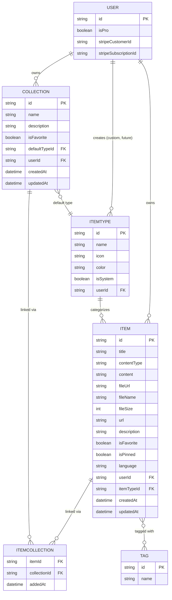
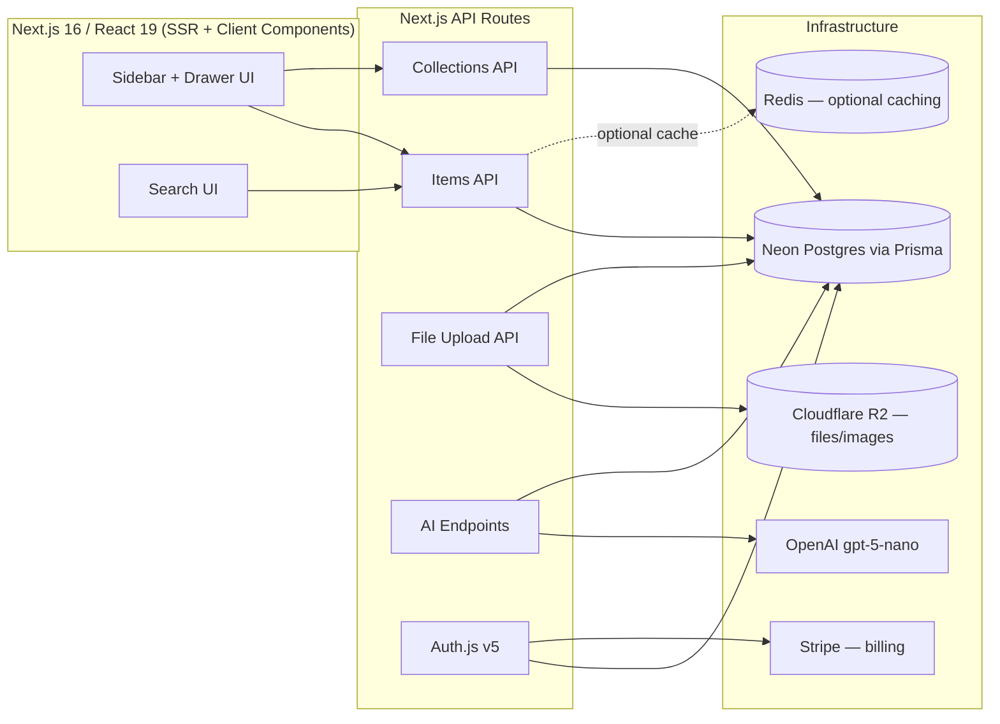

# 🗂️ DevStash — Project Overview

> One fast, searchable, AI-enhanced hub for all your dev knowledge & resources.

---

## 📌 Table of Contents

1. [Problem](#-problem)
2. [Target Users](#-target-users)
3. [Core Features](#-core-features)
4. [Data Model](#-data-model)
5. [Architecture](#-architecture)
6. [Tech Stack](#-tech-stack)
7. [Monetization](#-monetization)
8. [UI/UX](#-uiux)
9. [Open Questions / Decisions Needed](#-open-questions--decisions-needed)

---

## 🧩 Problem

Developers keep their essentials scattered across too many tools:

| Scattered Today | Should Live In |
|---|---|
| Code snippets | VS Code / Notion |
| AI prompts | Random chat threads |
| Context files | Buried in projects |
| Useful links | Browser bookmarks |
| Docs | Random folders |
| Commands | `.txt` files |
| Project templates | GitHub Gists |
| Terminal commands | Bash history |

This fragmentation causes **context switching, lost knowledge, and inconsistent workflows**. DevStash consolidates all of it into a single, fast, AI-enhanced hub.

---

## 👥 Target Users

| Persona | Core Need |
|---|---|
| 🧑‍💻 **Everyday Developer** | Fast capture/retrieval of snippets, prompts, commands, links |
| 🤖 **AI-first Developer** | Save & organize prompts, contexts, workflows, system messages |
| 🎥 **Content Creator / Educator** | Store code blocks, explanations, course notes |
| 🏗️ **Full-stack Builder** | Collect patterns, boilerplates, API examples |

---

## ⚙️ Core Features

### A. Items & Item Types

Items are the atomic unit of DevStash. Every item has a **type**, which determines how it's stored and rendered.

**System types** (built-in, cannot be edited/deleted by users):

| Type | Content Kind | Notes |
|---|---|---|
| `snippet` | text | code, syntax highlighted |
| `prompt` | text | AI prompts |
| `note` | text | markdown notes |
| `command` | text | terminal commands |
| `link` | url | bookmarked links |
| `file` | file | **Pro only** |
| `image` | file | **Pro only** |

- Custom user-defined types are a **planned future feature** (not in v1 — see Monetization).
- Items should be creatable/accessible via a **quick-access drawer** (low friction capture).
- Route convention: `/items/[type]` → e.g. `/items/snippets`.

### B. Collections

- Users organize items into **collections** (e.g. *React Patterns*, *Context Files*, *Python Snippets*).
- Collections can hold items of **any type** (mixed types allowed).
- Items can belong to **multiple collections** simultaneously (many-to-many), e.g. a React snippet living in both *React Patterns* and *Interview Prep*.

### C. Search

Unified search across:
- Content
- Tags
- Titles
- Types

### D. Authentication

- Email/password
- GitHub OAuth
- Powered by **Auth.js (NextAuth) v5**

### E. Other Features

- ⭐ Favorite items & collections
- 📌 Pin items to top
- 🕓 Recently used items
- 📥 Import code from a file
- 📝 Markdown editor for text-based types
- 📤 File upload for `file` / `image` types
- 📦 Export data (multiple formats)
- 🌙 Dark mode (default)
- 🔗 Add/remove an item to/from multiple collections
- 👁️ View which collections a given item belongs to

### F. AI Features (Pro only)

- 🏷️ AI auto-tag suggestions
- 📄 AI summaries
- 💡 "Explain this code" (AI)
- ✨ AI prompt optimizer

---

## 🗃️ Data Model

> Rough draft — subject to change as schema is finalized in Prisma.

### Entity Relationship Diagram



### Prisma Schema (draft)

```prisma
// schema.prisma
// NOTE: Run via `prisma migrate dev` / `prisma migrate deploy`.
// ⚠️ NEVER use `db push` — migrations only (dev → prod).

generator client {
  provider = "prisma-client-js"
}

datasource db {
  provider = "postgresql"
  url      = env("DATABASE_URL") // Neon
}

// --- Auth.js required models (abridged — extend per Auth.js v5 Prisma adapter) ---

model User {
  id                   String   @id @default(cuid())
  name                 String?
  email                String?  @unique
  emailVerified        DateTime?
  image                String?

  // Billing
  isPro                Boolean  @default(false)
  stripeCustomerId     String?  @unique
  stripeSubscriptionId String?  @unique

  // Relations
  items       Item[]
  collections Collection[]
  itemTypes   ItemType[]

  createdAt DateTime @default(now())
  updatedAt DateTime @updatedAt
}

model Item {
  id          String   @id @default(cuid())
  title       String
  contentType ContentType

  content     String?  // text content (null if file-based)
  fileUrl     String?  // R2 URL (null if text-based)
  fileName    String?
  fileSize    Int?
  url         String?  // for `link` type
  description String?
  language    String?  // optional, for syntax highlighting

  isFavorite Boolean @default(false)
  isPinned   Boolean @default(false)

  user   User   @relation(fields: [userId], references: [id], onDelete: Cascade)
  userId String

  itemType   ItemType @relation(fields: [itemTypeId], references: [id])
  itemTypeId String

  collections ItemCollection[]
  tags        Tag[]            @relation("ItemTags")

  createdAt DateTime @default(now())
  updatedAt DateTime @updatedAt

  @@index([userId])
  @@index([itemTypeId])
}

model ItemType {
  id       String  @id @default(cuid())
  name     String
  icon     String
  color    String
  isSystem Boolean @default(false)

  // null for system types; set for user-created custom types (future)
  user   User?   @relation(fields: [userId], references: [id], onDelete: Cascade)
  userId String?

  items             Item[]
  defaultCollections Collection[] @relation("DefaultType")

  @@unique([name, userId])
}

model Collection {
  id          String  @id @default(cuid())
  name        String
  description String?
  isFavorite  Boolean @default(false)

  defaultType   ItemType? @relation("DefaultType", fields: [defaultTypeId], references: [id])
  defaultTypeId String?

  user   User   @relation(fields: [userId], references: [id], onDelete: Cascade)
  userId String

  items ItemCollection[]

  createdAt DateTime @default(now())
  updatedAt DateTime @updatedAt

  @@index([userId])
}

model ItemCollection {
  item         Item       @relation(fields: [itemId], references: [id], onDelete: Cascade)
  itemId       String
  collection   Collection @relation(fields: [collectionId], references: [id], onDelete: Cascade)
  collectionId String
  addedAt      DateTime   @default(now())

  @@id([itemId, collectionId])
}

model Tag {
  id    String @id @default(cuid())
  name  String @unique
  items Item[] @relation("ItemTags")
}

enum ContentType {
  TEXT
  URL
  FILE
}
```

**Modeling notes:**
- `ItemCollection` is the explicit join table enabling the many-to-many `Item ↔ Collection` relationship, with `addedAt` tracked per-link.
- `ItemType.userId` is nullable — `null` = system type (shared, immutable), non-null = user's custom type (future/Pro feature).
- Consider a `TagsOnItems` implicit vs. explicit join — implicit (`@relation("ItemTags")`) is fine unless you need per-tag metadata later.
- `Collection.defaultTypeId` pre-selects the item type when creating a new item inside an empty collection.

---

## 🏗️ Architecture



---

## 🛠️ Tech Stack

| Layer | Choice | Notes |
|---|---|---|
| **Framework** | [Next.js 16](https://nextjs.org/docs) / [React 19](https://react.dev) | SSR pages + dynamic client components; single repo (monolith) for low overhead |
| **API** | Next.js API routes | Handles item storage, file uploads, AI calls |
| **Language** | TypeScript | End-to-end type safety |
| **Database** | [Neon](https://neon.tech/docs) (Postgres, serverless) | Cloud-hosted |
| **ORM** | [Prisma 7](https://www.prisma.io/docs) | ⚠️ Migrations only — **never** `db push` in dev or prod |
| **Caching** | Redis (maybe) | Deferred — evaluate need post-MVP |
| **File Storage** | [Cloudflare R2](https://developers.cloudflare.com/r2/) | For `file` / `image` item types |
| **Auth** | [Auth.js (NextAuth) v5](https://authjs.dev) | Email/password + GitHub OAuth |
| **AI** | OpenAI `gpt-5-nano` | Auto-tagging, summaries, code explanation, prompt optimization |
| **Styling** | [Tailwind CSS v4](https://tailwindcss.com) + [shadcn/ui](https://ui.shadcn.com) | Dark mode default |
| **Payments** | Stripe | Subscription management (`stripeCustomerId`, `stripeSubscriptionId`) |

> 📌 **Reminder:** Fetch the latest Prisma 7 docs before implementation — API surface may have shifted from Prisma 5/6 patterns.

---

## 💰 Monetization

Freemium model:

| | Free | Pro — $8/mo or $72/yr |
|---|---|---|
| Items | 50 total | Unlimited |
| Collections | 3 | Unlimited |
| System types | All except file/image | All |
| File & image uploads | ❌ | ✅ |
| Custom types | ❌ | 🔜 Coming later |
| Search | Basic | Basic |
| AI auto-tagging | ❌ | ✅ |
| AI code explanation | ❌ | ✅ |
| AI prompt optimizer | ❌ | ✅ |
| Data export | ❌ | ✅ JSON / ZIP |
| Support | Standard | Priority |

> 🚧 **Dev-mode note:** During development, gate the plumbing (`isPro` checks, limits) but leave all features unlocked for every user so the full product can be tested end-to-end before billing goes live.

---

## 🎨 UI/UX

### General Direction
- Modern, minimal, developer-focused — inspired by **Notion, Linear, Raycast**
- Dark mode by default; light mode optional
- Clean typography, generous whitespace, subtle borders/shadows
- Syntax highlighting on all code blocks

### Layout
- **Sidebar** (collapsible): item types (Snippets, Commands, etc.) with links, plus latest collections
- **Main area**: grid of collection cards, color-coded by the item type they hold the most of
- Items nest under their collection cards, border-colored by item type
- **Item detail** opens in a quick-access drawer (not a full page navigation)

### Type Colors & Icons

| Type | Color | Hex | Icon (lucide) |
|---|---|---|---|
| Snippet | 🔵 Blue | `#3b82f6` | `Code` |
| Prompt | 🟣 Purple | `#8b5cf6` | `Sparkles` |
| Command | 🟠 Orange | `#f97316` | `Terminal` |
| Note | 🟡 Yellow | `#fde047` | `StickyNote` |
| File | ⚪ Gray | `#6b7280` | `File` |
| Image | 🩷 Pink | `#ec4899` | `Image` |
| Link | 🟢 Emerald | `#10b981` | `Link` |

### Responsive
- Desktop-first, mobile-usable
- Sidebar collapses into a drawer on mobile

### Micro-interactions
- Smooth transitions
- Hover states on cards
- Toast notifications for actions
- Loading skeletons while fetching

### Screenshots
Refers to the screenshots below as a base for the dashboard UI. It does not to be exact. Use it as reference
- @context/screenshots/dashboard-ui-main.png
- @context/screenshots/dashboard-ui-drawer.png
---

## ❓ Open Questions / Decisions Needed

- **Custom item types**: full spec deferred to post-MVP (Pro feature) — needs its own icon/color picker UX.
- **Redis caching**: worth adding at launch, or defer until there's measurable read load?
- **Export formats**: confirm exact formats (JSON confirmed; ZIP for files — Markdown export for notes/snippets?).
- **Tag model**: currently global/unscoped (`Tag.name @unique`) — should tags be scoped per-user to avoid collisions across accounts?
- **`contentType` vs per-type storage**: confirm the `TEXT | URL | FILE` enum on `Item` covers all seven system types cleanly (e.g. does `note` differ meaningfully from `snippet` at the schema level, or only in UI/icon?).
- **Rate limiting** on AI endpoints (`gpt-5-nano` calls) to control cost on Pro tier.
